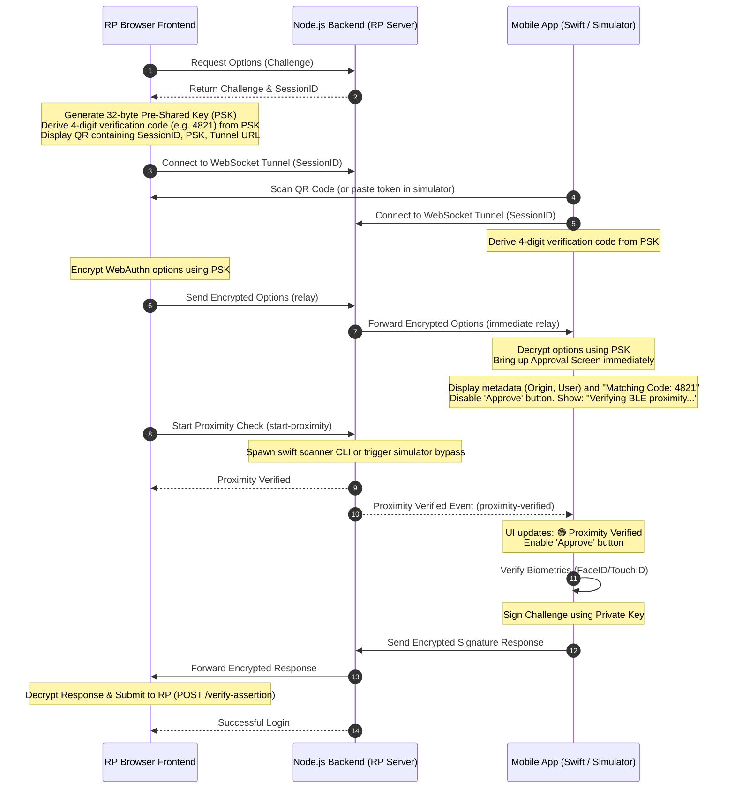

# FIDO CTAP2.1 Hybrid Passkey Authenticator: Technical Specification & Implementation Plan

This document serves as the master technical blueprint and implementation plan for the **Passkey Mobile Authenticator App** and its integration with a **Relying Party (RP) Browser App** and a **Node.js Backend & Tunnel Server**.

---

## 1. Architectural Components & Directory Structure

We will organize the workspace `/Users/gershwin/Documents/antigravity/adventurous-pasteur` into the following structure:

```
adventurous-pasteur/
├── poc-stuck-backend/
│   ├── ble_scanner.swift       # Swift macOS CoreBluetooth CLI scanner
│   ├── ble_scanner             # Compiled binary (generated at runtime)
│   ├── server.js               # Node.js backend (Express + WebSockets)
│   ├── package.json            # Node dependencies & Jest test commands
│   └── tests/
│       └── server.test.js      # Jest unit and integration tests
├── browser/
│   ├── index.html              # Relying Party web UI
│   ├── style.css               # Vanilla CSS styling
│   └── app.js                  # Frontend client logic & crypto
└── mobile/
    ├── ios/
    │   └── AuthenticatorApp/   # Native SwiftUI project
    │       ├── AuthenticatorApp.swift # App entry point
    │       ├── ContentView.swift      # Main dashboard & approval prompts
    │       ├── QRScannerView.swift    # Camera scanner (AVFoundation)
    │       ├── BLEAdvertiser.swift    # CoreBluetooth advertiser
    │       ├── CryptoManager.swift    # CryptoKit wrapper (P-256, GCM)
    │       ├── TunnelClient.swift     # URLSessionWebSocketTask client
    │       └── CredentialProviderExtension/ # Custom Passkey Provider Target
    │           ├── CredentialProviderViewController.swift # Autofill ViewController
    │           └── Info.plist         # Extension configuration
    └── simulator/
        ├── index.html          # Mobile Responsive Web PWA Simulator
        ├── style.css           # Mobile simulator CSS
        └── app.js              # Simulator logic (Web Crypto API + Websockets)
```

---

## 2. End-to-End Hybrid Transport Flow (Optimized with Parallel Proximity)

To provide a premium user experience, the system performs **Parallel BLE Proximity Verification**:
1. When the mobile client connects, FIDO WebAuthn options are immediately encrypted and relayed so the mobile app can display the **Approval Screen** (Metadata details, origin, and IP address) without waiting for BLE scanning.
2. In parallel, the backend spawns the BLE proximity check. The mobile approval screen displays a loading status for the proximity check and **disables** the biometric "Approve" button.
3. Once the BLE scanner confirms the device is nearby, the server notifies the mobile app via WebSocket. The approval screen updates to a green **"Proximity Verified"** state and enables the biometric validation.
4. **Anti-Phishing Verification Code**: To prevent authorization of remote attacks, a visual matching confirmation code (derived cryptographically from the PSK) is displayed on both the browser and mobile screens.



---

## 3. Open Questions & User Review Required

> [!IMPORTANT]
> **Implementation Review Details**:
> * **Code Generation Strategy**: We will derive a 4-digit numeric verification code (e.g. `4821`) from the PSK using a simple SHA-256 hash operation.
> * **Parallel WebSocket Relay**: We must adjust the WebSocket handler in `server.js` to immediately relay packets if both clients are connected, bypassing the old restriction that required `session.proximityVerified` before relaying. Proximity checks will be executed in parallel and enforce approval buttons to unlock only upon a `proximity-verified` event.

---

## 4. Proposed Changes

We will edit the following components:

### A. Backend (`poc-stuck-backend`)

#### [MODIFY] [server.js](file:///Users/gershwin/Documents/antigravity/adventurous-pasteur/poc-stuck-backend/server.js)
* Allow `relay` events to proceed even if `proximityVerified` is false, so long as both `browserSocket` and `mobileSocket` are present.
* Retain enforcement of proximity check execution: the server will still require the final assertion submission to match the challenge, but the mobile app UI controls the biometric lock based on the `proximity-verified` message relayed from the server.

### B. Relying Party Browser Portal (`browser`)

#### [MODIFY] [app.js](file:///Users/gershwin/Documents/antigravity/adventurous-pasteur/browser/app.js)
* Compute a 4-digit verification code from the PSK (e.g., hash the PSK and format the first few bytes as a numeric code) and render it on the screen.
* Modify the websocket connection logic to send the encrypted WebAuthn options immediately when the mobile client connects (`peer-status` event showing `mobileConnected: true`), rather than waiting for the proximity check to resolve first.

#### [MODIFY] [index.html](file:///Users/gershwin/Documents/antigravity/adventurous-pasteur/browser/index.html)
* Add a DOM container displaying the generated **Verification Code** in a prominent place (e.g. adjacent to the QR code).

### C. Native iOS App (`mobile/ios`)

#### [MODIFY] [ContentView.swift](file:///Users/gershwin/Documents/antigravity/adventurous-pasteur/mobile/ios/AuthenticatorApp/ContentView.swift)
* Update state to include `isProximityVerified` and `verificationCode`.
* Display the Derived Verification Code on the Approval screen.
* Transition to the approval screen (`.approve`) immediately upon receiving and decrypting the FIDO options.
* Display the BLE proximity scan status dynamically on the approval card:
  - 🔵 Scanning for nearby device... (Disabled Approve button)
  - 🟢 Device Verified Nearby (Enabled Approve button)
  - 🔴 Proximity Check Failed (Disabled Approve button)
* Enable the "Approve FaceID" button only when `isProximityVerified` is true.

### D. PWA Mobile Simulator (`mobile/simulator`)

#### [MODIFY] [app.js](file:///Users/gershwin/Documents/antigravity/adventurous-pasteur/mobile/simulator/app.js)
* Implement the same derived verification code logic.
* Change state transitions to show the approval screen immediately.
* Update UI elements dynamically to reflect the `proximity-verified` event, locking/unlocking the biometric prompt button.

#### [MODIFY] [index.html](file:///Users/gershwin/Documents/antigravity/adventurous-pasteur/mobile/simulator/index.html)
* Add status and verification code slots in the simulator's Approve login view.

---

## 5. Verification Plan

### Automated Tests
* Run `npx jest --forceExit` to verify E2EE helpers and signaling pathways remain correct under isolated conditions.

### Manual Verification
* Start the server using `npm start`.
* Perform register/login using the updated SwiftUI simulator app:
  - Verify that the biometrics approval screen is displayed *before* the 1.5s simulator proximity check finishes.
  - Verify that the matching 4-digit code is visible on both Chrome and the Simulator.
  - Verify that the approval button is disabled, showing a scanning indicator, and unlocks only when the check passes.

---

## 6. System-Wide AutoFill Passkey Extension Integration

To register your app natively with iOS to serve as a password/passkey system autofill manager:

### Target Configuration
1. **Target Creation**: In Xcode, create a new target using the **Credential Provider Extension** template.
2. **Swift Controller ([CredentialProviderViewController.swift](file:///Users/gershwin/Documents/antigravity/adventurous-pasteur/mobile/ios/CredentialProviderExtension/CredentialProviderViewController.swift))**: Inherits from `ASCredentialProviderViewController` to handle password/passkey autofill queries. It cross-references the requesting domain (RP ID) against local registered credentials and returns ECDSA P-256 assertions authenticated via FaceID/TouchID.
3. **plist Parameters ([Info.plist](file:///Users/gershwin/Documents/antigravity/adventurous-pasteur/mobile/ios/CredentialProviderExtension/Info.plist))**: Configured with `com.apple.authentication-services-credential-provider` extension point identifier to register your custom app within the global iOS AutoFill registry.

### Provisioning & Domains
* Add the **Associated Domains** capability to the targets: `webcredentials:yourdomain.com`.
* Publish the Apple-App-Site-Association (AASA) trust file containing your App Bundle ID on the Relying Party server at: `https://yourdomain.com/.well-known/apple-app-site-association`.
* Activate the integration under **Settings > Passwords > Password Options** (or **AutoFill Passwords & Passkeys**) on the device.

